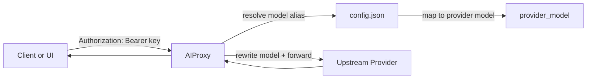
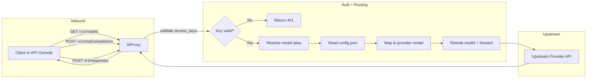

# AIProxy

中文 / English:
- 中文文档：`README.md`
- English docs: `README.en.md`

AIProxy is a lightweight OpenAI-compatible API proxy:
- Map friendly model IDs to provider configs (base_url / api_key / model)
- Serve `/v1/models`, `/v1/chat/completions`, and `/v1/responses`
- Built-in test + config builder page (Chinese/English)

## Features
- Model alias mapping for any OpenAI-compatible provider
- `/v1/models` output matches OpenAI structure
- Access key validation (access_keys) used only by this proxy
- Hot reload config.json (no restart required)
- Built-in API Console + config.json generator
- Configurable CORS, health checks, structured logs
- Optional rate limiting (per key or IP)
- Strict request validation (Pydantic) with broader OpenAI parameter coverage
- Test page supports request history and streaming output

## Project layout
```
src/
  aiproxy/
    api/
      handlers.py
      middleware.py
      schemas.py
      streaming.py
    core/
      app.py
      config.py
      ratelimit.py
      settings.py
    services/
      openai_service.py
    utils/
      logging.py
      http.py
      params.py
    templates/
      index.html
    __main__.py
```

## Architecture


## Detailed request flow


## Request flow (summary)
1) Client calls AIProxy with `model` + `Authorization` key.
2) AIProxy validates the key and filters allowed models.
3) AIProxy maps public model ID to provider `base_url/api_key/model`.
4) AIProxy forwards the request and returns the OpenAI-compatible response.
## Quick Start (Docker)
1) Copy and edit config:
```bash
cp config.example.json config.json
```
2) Start containers:
```bash
docker compose up -d --build
```
3) Open API Console:
```
http://<host>:<port>/
```

## Config (config.json)
Structure:
```json
{
  "server": { "port": 4000 },
  "defaults": { "model": "aiproxy-gemini" },
  "access_keys": "your-proxy-key",
  "cors": { "origins": ["*"], "allow_credentials": false },
  "rate_limit": { "requests": 60, "window_seconds": 60 },
  "logging": {
    "sample_rate": 1.0,
    "include_headers": false,
    "include_body": false,
    "redact_headers": ["authorization", "x-api-key", "api-key"],
    "redact_keys": ["api_key", "apiKey", "access_keys"]
  },
  "providers": {
    "gemini": {
      "base_url": "https://generativelanguage.googleapis.com/v1beta/openai/",
      "api_key": "YOUR_GEMINI_KEY"
    }
  },
  "models": [
    {
      "id": "aiproxy-gemini",
      "provider": "gemini",
      "model": "gemini-2.0-flash",
      "owned_by": "openai",
      "permission": [],
      "root": "aiproxy-gemini",
      "parent": null
    }
  ]
}
```

### access_keys formats
1) Single global key:
```json
"access_keys": "your-proxy-key"
```

2) Multiple keys (all models allowed):
```json
"access_keys": ["key-a", "key-b"]
```

3) Key-to-model mapping:
```json
"access_keys": {
  "team-alpha": { "models": ["aiproxy-gemini"] },
  "team-beta": { "models": ["aiproxy-openrouter"] },
  "admin": {}
}
```
> Note: empty or missing `models` allows all models. An empty array `[]` allows none.

### Field reference
- `server.port`: listen port (optional)
- `defaults.model`: default model ID (optional)
- `access_keys`: inbound access keys (optional)
- `cors`: CORS configuration (optional)
  - `origins`: allowed origins (array or comma-separated string, supports `*`)
  - `allow_credentials`: allow credentials or not
- `rate_limit`: rate limiting (optional)
  - `requests`: max requests per window
  - `window_seconds`: window length in seconds
  - applied per key first, then IP
- `logging`: logging (optional)
  - `sample_rate`: sample rate (0~1, default 1)
  - `include_headers`: include request headers
  - `include_body`: include JSON request body (sensitive)
  - `redact_headers`: headers to redact
  - `redact_keys`: JSON keys to redact
- `responses`: /v1/responses behavior (optional, prefer per-model config)
  - `mode`: `auto` (default, use responses when supported, otherwise fall back to chat), `native` (responses only), `chat` (always use chat)
- `providers`: provider config (required)
  - `base_url`: OpenAI-compatible endpoint
  - `api_key`: provider key
  - `responses.mode`: provider-level responses strategy (lower priority than model)
- `models`: exposed model list (required)
  - `id`: public model ID
  - `provider`: provider key name
  - `model`: upstream model name
  - `owned_by` / `permission` / `root` / `parent`: display-only in `/v1/models`, can be omitted
  - `responses.mode`: responses strategy for this model (overrides provider and global)

## Example configs
- `config.example.json`: single key example
- `config.example.map.json`: key-to-model mapping example
- `config.schema.json`: JSON Schema for config validation

## API usage
> If `access_keys` is set, include `Authorization: Bearer <key>`.

### List models
```bash
curl http://localhost:4000/v1/models \
  -H "Authorization: Bearer your-proxy-key"
```
Example response (fields may vary by provider):
```json
{
  "object": "list",
  "data": [
    {
      "id": "aiproxy-gemini",
      "object": "model",
      "owned_by": "openai"
    }
  ]
}
```

### Chat Completions
```bash
curl http://localhost:4000/v1/chat/completions \
  -H "Authorization: Bearer your-proxy-key" \
  -H "Content-Type: application/json" \
  -d '{
    "model": "aiproxy-gemini",
    "messages": [{"role": "user", "content": "Hello"}]
  }'
```
Example response (fields may vary by provider):
```json
{
  "id": "chatcmpl-xxx",
  "object": "chat.completion",
  "created": 1700000000,
  "model": "aiproxy-gemini",
  "choices": [
    {
      "index": 0,
      "message": { "role": "assistant", "content": "Hello!" },
      "finish_reason": "stop"
    }
  ],
  "usage": { "prompt_tokens": 0, "completion_tokens": 0, "total_tokens": 0 }
}
```

### Responses
```bash
curl http://localhost:4000/v1/responses \
  -H "Authorization: Bearer your-proxy-key" \
  -H "Content-Type: application/json" \
  -d '{
    "model": "aiproxy-gemini",
    "input": "Summarize today in one sentence"
  }'
```
Example response (fields may vary by provider):
```json
{
  "id": "resp-xxx",
  "object": "response",
  "model": "aiproxy-gemini",
  "output": [
    {
      "type": "message",
      "role": "assistant",
      "content": [{ "type": "output_text", "text": "Today was productive." }]
    }
  ]
}
```

## API Console + Config Builder
- Open `http://<host>:<port>/`
- Supports Chinese/English (auto from browser)
- Page itself does not need a key; test requests require a key
- Stream output supported (toggle Stream)
- Generate/copy/download `config.json`
- Request history with export

## Health & Version
- `GET /healthz`: status only by default; add `?verbose=1` for uptime and config warnings
- `GET /version`: version string

## Error format (OpenAI-compatible)
```json
{
  \"error\": {
    \"message\": \"Unauthorized\",
    \"type\": \"authentication_error\",
    \"param\": null,
    \"code\": null
  }
}
```

## Response headers
- `X-Request-ID`: request trace ID
- `X-RateLimit-Limit` / `X-RateLimit-Remaining` / `X-RateLimit-Reset` (when enabled)

## Environment fallback (optional)
If `config.json` is missing, the server falls back to:

Other env vars:
- `CONFIG_PATH`: custom config path
- `PORT`: fallback port when `server.port` is empty
- `CREATE_LOG`: enable request logging (True/False)
- `LOG_LEVEL`: log level (INFO/DEBUG)
- `APP_VERSION`: service version
- `UPSTREAM_TIMEOUT`: upstream timeout in seconds (default 60)
- `UPSTREAM_MAX_RETRIES`: upstream max retries (default 2)
- `STRICT_CONFIG`: strict config validation (True/False)
- `MAX_BODY_MB`: request body size limit in MB (default 4)
- `LOG_DIR`: log directory (default `./src/logs`)
- `LOG_FILE_MAX_MB`: max size per log file in MB (default 10)
- `LOG_FILE_BACKUPS`: number of rotated log files to keep (default 5)
- `aiproxy.log` (all logs) and `chat_completions.log` (request details, needs `CREATE_LOG=True`) are created under `LOG_DIR`
- `LOG_TO_FILE`: enable file logging (True/False, default True). Falls back to stdout if file logging fails.
- When `logging.include_body=true`, upstream request details are logged (includes `upstream_url` and `payload`).

## Local Run (non-Docker)
```bash
cd ./src
cp .env.example .env
python -m venv myenv
source myenv/bin/activate
pip install -r ../requirements.txt
python -m aiproxy
```
