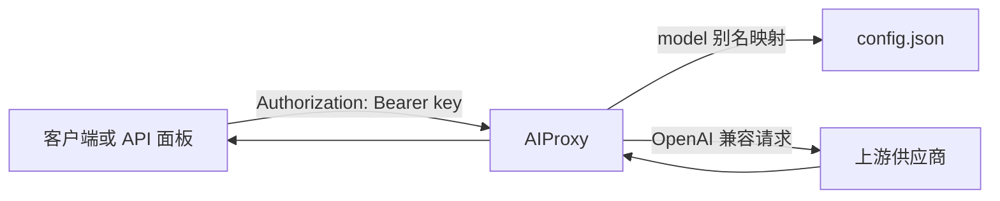
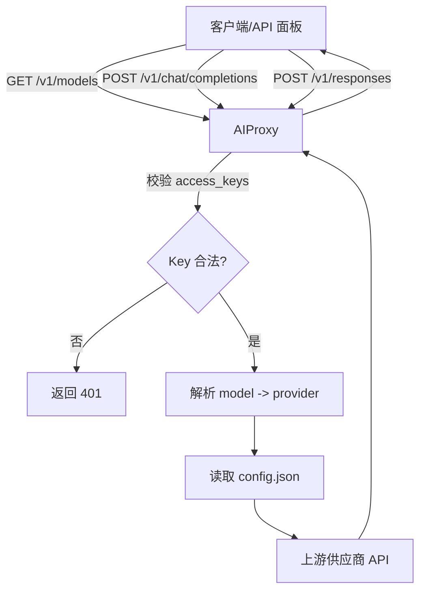

# AIProxy

中文 / English:
- 中文文档：`README.md`
- English docs: `README.en.md`

AIProxy 是一个轻量的 OpenAI 兼容 API 代理：
- 使用友好的模型别名（model ID）映射到不同运营商（base_url / api_key / model）
- 统一提供 `/v1/models`、`/v1/chat/completions`、`/v1/responses`
- 内置 API 面板与配置生成页面（支持中英文）

## 功能特性
- 模型别名映射到任意 OpenAI 兼容供应商
- `/v1/models` 返回与 OpenAI 一致的结构
- 访问密钥校验（access_keys），只用于本代理，不下发给上游
- 配置文件热加载（改 `config.json` 后无需重启）
- 内置网页测试与 `config.json` 生成器
- CORS 可配置、内置健康检查、结构化日志
- 可选限流（按 key 或 IP）
- 请求字段严格校验（Pydantic），支持更完整的 OpenAI 参数
- API 面板支持请求历史与流式输出

## 项目结构
```
src/
  aiproxy/
    api/
      handlers.py
      middleware.py
      schemas.py
      streaming.py
    core/
      app.py
      config.py
      ratelimit.py
      settings.py
    services/
      openai_service.py
    utils/
      logging.py
      http.py
      params.py
    templates/
      index.html
    __main__.py
```

## 架构示意


## 接口流程图（详细）


## 请求流程（简述）
1) 客户端携带 `model` + `Authorization` key 调用 AIProxy。
2) AIProxy 校验 key 并过滤可用模型。
3) AIProxy 将公开模型别名映射为上游 `base_url/api_key/model`。
4) AIProxy 转发请求并返回 OpenAI 兼容响应。

## 快速开始（Docker）
1) 复制并编辑配置文件：
```bash
cp config.example.json config.json
```
2) 启动容器：
```bash
docker compose up -d --build
```
3) 打开 API 面板：
```
http://<host>:<port>/
```

## 配置文件（config.json）
主要结构如下：
```json
{
  "server": { "port": 4000 },
  "defaults": { "model": "aiproxy-gemini" },
  "access_keys": "your-proxy-key",
  "cors": { "origins": ["*"], "allow_credentials": false },
  "rate_limit": { "requests": 60, "window_seconds": 60 },
  "logging": {
    "sample_rate": 1.0,
    "include_headers": false,
    "include_body": false,
    "redact_headers": ["authorization", "x-api-key", "api-key"],
    "redact_keys": ["api_key", "apiKey", "access_keys"]
  },
  "providers": {
    "gemini": {
      "base_url": "https://generativelanguage.googleapis.com/v1beta/openai/",
      "api_key": "YOUR_GEMINI_KEY"
    }
  },
  "models": [
    {
      "id": "aiproxy-gemini",
      "provider": "gemini",
      "model": "gemini-2.0-flash",
      "owned_by": "openai",
      "permission": [],
      "root": "aiproxy-gemini",
      "parent": null
    }
  ]
}
```

### access_keys 的三种写法
1) 单一全局密钥（最简单）：
```json
"access_keys": "your-proxy-key"
```

2) 多个密钥（全部放行模型）：
```json
"access_keys": ["key-a", "key-b"]
```

3) 密钥映射到模型（精细控制）：
```json
"access_keys": {
  "team-alpha": { "models": ["aiproxy-gemini"] },
  "team-beta": { "models": ["aiproxy-openrouter"] },
  "admin": {}
}
```
> 说明：`models` 不填或为空对象 `{}` 表示允许所有模型；如果填空数组 `[]` 则表示不允许任何模型。

### 配置字段说明
- `server.port`：服务端口（可选）
- `defaults.model`：默认模型别名（可选）
- `access_keys`：访问密钥（可选）
- `cors`：跨域设置（可选）
  - `origins`：允许的 Origin（数组或逗号分隔字符串，支持 `*`）
  - `allow_credentials`：是否允许携带凭据
- `rate_limit`：限流（可选）
  - `requests`：窗口内最大请求数
  - `window_seconds`：窗口长度（秒）
  - 限流维度：优先按 key，否则按 IP
- `logging`：日志（可选）
  - `sample_rate`：采样率（0~1，默认 1）
  - `include_headers`：是否记录请求头
  - `include_body`：是否记录 JSON 请求体（注意敏感信息）
  - `redact_headers`：需要脱敏的头部列表
  - `redact_keys`：需要脱敏的 JSON 字段列表
- `responses`：/v1/responses 行为（可选，建议在 model 内配置）
  - `mode`：`auto`（默认，支持则用 responses，不支持则回退 chat）、`native`（只用 responses）、`chat`（始终用 chat）
- `providers`：供应商配置（必填）
  - `base_url`：OpenAI 兼容 API 地址
  - `api_key`：供应商密钥
  - `responses.mode`：供应商级 responses 策略（优先级低于 model）
- `models`：对外暴露的模型列表（必填）
  - `id`：对外模型别名（client 请求时使用）
  - `provider`：供应商 key（对应 providers 下的名字）
  - `model`：实际供应商模型名
  - `owned_by` / `permission` / `root` / `parent`：仅用于 `/v1/models` 展示，可省略
  - `responses.mode`：当前模型的 responses 策略（优先级高于 provider 和全局）

## 示例配置
- `config.example.json`：单一 key 的示例
- `config.example.map.json`：按 key 限制模型的示例
- `config.schema.json`：配置 JSON Schema（可用于校验）

## API 使用示例
> 注意：如果配置了 `access_keys`，需要在请求里带 `Authorization: Bearer <key>`。

### 获取模型列表
```bash
curl http://localhost:4000/v1/models \
  -H "Authorization: Bearer your-proxy-key"
```
示例响应（字段可能因上游而异）：
```json
{
  "object": "list",
  "data": [
    {
      "id": "aiproxy-gemini",
      "object": "model",
      "owned_by": "openai"
    }
  ]
}
```

### Chat Completions
```bash
curl http://localhost:4000/v1/chat/completions \
  -H "Authorization: Bearer your-proxy-key" \
  -H "Content-Type: application/json" \
  -d '{
    "model": "aiproxy-gemini",
    "messages": [{"role": "user", "content": "你好"}]
  }'
```
示例响应（字段可能因上游而异）：
```json
{
  "id": "chatcmpl-xxx",
  "object": "chat.completion",
  "created": 1700000000,
  "model": "aiproxy-gemini",
  "choices": [
    {
      "index": 0,
      "message": { "role": "assistant", "content": "你好！" },
      "finish_reason": "stop"
    }
  ],
  "usage": { "prompt_tokens": 0, "completion_tokens": 0, "total_tokens": 0 }
}
```

### Responses
```bash
curl http://localhost:4000/v1/responses \
  -H "Authorization: Bearer your-proxy-key" \
  -H "Content-Type: application/json" \
  -d '{
    "model": "aiproxy-gemini",
    "input": "用一句话总结今天"
  }'
```
示例响应（字段可能因上游而异）：
```json
{
  "id": "resp-xxx",
  "object": "response",
  "model": "aiproxy-gemini",
  "output": [
    {
      "type": "message",
      "role": "assistant",
      "content": [{ "type": "output_text", "text": "今天过得很充实。" }]
    }
  ]
}
```

## API 面板与配置生成页面
- 访问 `http://<host>:<port>/` 打开 API 面板
- 页面支持中英文切换（默认跟随浏览器）
- 页面本身不需要 key，但发起测试请求时需要填写 key
- 支持流式输出（勾选 Stream）
- 支持生成并复制/下载 `config.json`
- 支持请求历史与一键导出

## 健康检查与版本
- `GET /healthz`：默认只返回状态；加 `?verbose=1` 返回启动时长、配置告警（含校验提示）
- `GET /version`：返回版本号

## 错误格式（OpenAI 兼容）
```json
{
  "error": {
    "message": "Unauthorized",
    "type": "authentication_error",
    "param": null,
    "code": null
  }
}
```

## 响应头
- `X-Request-ID`：请求追踪 ID
- `X-RateLimit-Limit` / `X-RateLimit-Remaining` / `X-RateLimit-Reset`：限流信息（启用时）

## 环境变量（可选回退）
当 `config.json` 不存在时，会回退到环境变量：

其他可用变量：
- `CONFIG_PATH`：指定配置文件路径
- `PORT`：端口回退值（当 `server.port` 为空时）
- `CREATE_LOG`：是否写入请求日志（True/False）
- `LOG_LEVEL`：日志级别（INFO/DEBUG）
- `APP_VERSION`：服务版本号
- `UPSTREAM_TIMEOUT`：上游请求超时（秒，默认 60）
- `UPSTREAM_MAX_RETRIES`：上游最大重试次数（默认 2）
- `STRICT_CONFIG`：严格配置校验（True/False）
- `MAX_BODY_MB`：请求体大小上限（MB，默认 4）
- `LOG_DIR`：日志目录（默认 `./src/logs`）
- `LOG_FILE_MAX_MB`：单个日志文件最大大小（MB，默认 10）
- `LOG_FILE_BACKUPS`：日志滚动保留文件数（默认 5）
- `LOG_DIR` 下会生成 `aiproxy.log`（全量日志）和 `chat_completions.log`（请求详情，需 `CREATE_LOG=True`）
- `LOG_TO_FILE`：是否写入文件日志（True/False，默认 True）。无权限时会自动回退到终端日志。
- 当 `logging.include_body=true` 时，会额外记录上游请求参数（包含 `upstream_url`、`payload`）

## 本地运行（非 Docker）
```bash
cd ./src
cp .env.example .env
python -m venv myenv
source myenv/bin/activate
pip install -r ../requirements.txt
python -m aiproxy
```
